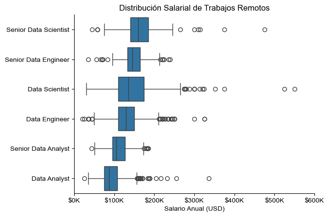

# Resumen

Bienvenidos a mi análisis del mercado laboral en el mundo de los datos. El objetivo de este proyecto es investigar las skills mejores pagas y/o más buscadas en los empleos, para poder encontrar las oportunidades de trabajo más óptimas y entender mejor este mercado laboral.

Las columnas contienen detallados datos sobre cada rol, salario, ubicaciones y skills esenciales. El dataset tiene como fuente al repositorio de [Luke Barousse](https://huggingface.co/datasets/lukebarousse/data_jobs) en [Hugging Face](https://huggingface.co), una plataforma que uso asiduamente para obtener información en la cual poder realizar análisis de datos.

# Incógnitas a resolver
1. ¿Ubicaciones de las búsquedas laborales de Analistas de Datos en Argentina?
2. ¿Qué compañías lideran las búsquedas de Analistas de Datos en Argentina?
3. ¿Cuántas de las búsquedas laborales en Argentina permiten el trabajo remoto? ¿Cuántas búsquedas laborales en Argentina mencionan el requerimiento de un título universitario?
4. ¿Cuáles son las skills más requeridas en el mundo de los datos?
5. ¿Cuál es la distribución salarial en los trabajos remotos?
6. ¿Qué skills son las más requeridas y mejores pagas en los trabajos remotos?

# Preparación y limpieza

En esta sección describo los pasos esenciales de preparación de los datos a ser analizados, para lograr precisión y utilidad de los mismos.

## Importación y limpieza de datos

El primer paso es importar cada una de las librerías necesarias (con su respectivo alias) y cargar el dataset, junto a algunos pasos de limpieza para asegurar la calidad de los datos.

Una muestra del dataset puede ser observada en este cuaderno: [1_Análisis_de_Trabajos_en_Argentina](1_Análisis_de_Trabajos_en_Argentina.ipynb)

```python
# Importamos librerías
import ast
import pandas as pd
import seaborn as sns
from datasets import load_dataset
import matplotlib.pyplot as plt

# Cargamos los datos
dataset = load_dataset('lukebarousse/data_jobs')
df = dataset['train'].to_pandas()

# Limpiamos los datos
df['job_posted_date'] = pd.to_datetime(df['job_posted_date']) # Usamos una función de Pandas para transformar la columna de 'str' a 'datetime'
df['job_skills'] = df['job_skills'].apply(lambda x: ast.literal_eval(x) if pd.notna(x) else x) # Usamos un módulo de Python para transformar la columna de 'str' a 'list'
```

# Análisis

Cada cuaderno Jupyter de este proyecto está dirigido a investigar aspectos específicos del mercado laboral de los datos.

Como aspirante a analista de datos, focalicé sobre dos mercados laborales que me podrían ser de interés:

1. Trabajos en Argentina
2. Trabajos de manera remota (global)

# Trabajos en Argentina

Creamos un DataFrame que contenga sólo los trabajos ubicados en Argentina.

```python
df_ARG = df[(df['job_country'] == 'Argentina')]
```

## 1. ¿Ubicaciones de las búsquedas laborales de Analistas de Datos?

Para encontrar las ubicaciones más comunes en búsqueda de un analista de datos, agrupamos y ordenamos el df según la ubicación. Antes de proceder a visualizar, realizamos unas tareas de limpieza del mismo en las entradas que tienen a "Argentina" como ciudad, lo cual indica que la búsqueda no especificó la ubicación concreta del empleo.

Como resultado de esta consulta obtenemos las top 10 ubicaciones con avisos de empleo, que posteriormente visualizamos utilizando las librerías Matplotlib y Seaborn.

Los pasos detallados de esta consulta se pueden observar en este cuaderno: [1_Análisis_de_Trabajos_en_Argentina](1_Análisis_de_Trabajos_en_Argentina.ipynb)

### Visualización de datos

```python
sns.set_theme(style='ticks')
sns.barplot(data=df_plot, x='count', y='job_location', hue='count', palette='dark:b_r', legend=False)
sns.despine()
plt.title('Empleos por Ubicación para Analista de Datos en Argentina')
plt.xlabel('Cantidad de empleos')
plt.ylabel('')
plt.show()
```

### Resultados


*Gráfico de barras visualizando las top 10 ubicaciones de búsqueda de Analistas de Datos en Argentina.*

### Observaciones:

- Buenos Aires acapara casi la totalidad del mercado laboral en territorio argentino, siendo 21 veces más grande que el interior de la provincia de Córdoba, la segunda ubicación geográfica del gráfico.
- El trabajo remoto parece una buena alternativa para los residentes del Interior del país, que de otra manera tienen un panorama desalentador con un número de búsquedas considerablemente minúsculo en comparación al área metropolitana.

## 2. ¿Qué compañías lideran las búsquedas de Analistas de Datos?

Con el objetivo de encontrar las compañías con más búsquedas publicadas de Analista de Datos, agrupamos el df según el nombre de la empresa. Aquí también debimos realizar tareas de limpieza para corregir valores incoherentes que no sean empresas, como plataformas de reclutamiento, entre otros.

El resultado fue las 8 empresas con más búsquedas, demostrando quiénes suelen ser las compañías en búsqueda constante de empleados.

Los pasos detallados de esta consulta se pueden observar en este cuaderno: [1_Análisis_de_Trabajos_en_Argentina](1_Análisis_de_Trabajos_en_Argentina.ipynb)

### Visualización de datos

```python
sns.set_theme(style='ticks')
sns.barplot(data=df_plot, x='count', y='company_name', hue='count', palette='dark:b_r', legend=False)
sns.despine()
plt.gca().xaxis.set_major_locator(plt.MaxNLocator(integer=True))
plt.title('Número de Trabajos por Compañía')
plt.xlabel('Número de Trabajos')
plt.ylabel('')
plt.show()
```

### Resultados


*Gráfico de barras visualizando las top 8 empresas liderando la búsqueda de Analistas de Datos en Argentina.*

### Observaciones:

- Empresas multinacionales de consultoría lideran las búsquedas, como Accenture o PwC. Estas se caracterizan por ofrecer diversos servicios en múltiples áreas por lo que es lógico que requieran más personal en el mundo de los datos.
- Se destaca también la importancia de un analista de datos en el rubro financiero, con búsquedas numerosas desde instituciones bancarias como BBVA hasta compañías de inversión como S&P o JPMorgan.

## 3. Trabajo Remoto & Mención de Título Universitario

Con la información disponible, también es de mi interés saber qué empresas permiten el trabajo remoto y cuántas exigen un título universitario como requisito indispensable.

Para ambos casos la visualización que utilizaremos es una gráfica circular.

Los pasos detallados de esta consulta se pueden observar en este cuaderno: [1_Análisis_de_Trabajos_en_Argentina](1_Análisis_de_Trabajos_en_Argentina.ipynb)

### Visualización de datos

```python
fig, ax = plt.subplots(1, 2)
fig.set_size_inches((12, 5))

# Cuenta la cantidad de trabajos remotos
counts = df_job_ARG['job_work_from_home'].value_counts()

plt.subplot(1, 2, 1)
plt.pie(counts, labels=counts.index.map({False: 'No', True: 'Sí'}), autopct='%1.1f%%', startangle=90)
plt.title('Trabajo Remoto')

# Cuenta la cantidad de trabajos sin mención de título universitario
counts = df_job_ARG['job_no_degree_mention'].value_counts()

plt.subplot(1, 2, 2)
plt.pie(counts, labels=counts.index.map({False: 'Título requerido', True: 'Título no necesario'}), autopct='%1.1f%%', startangle=90)
plt.title('Requerimiento de Título Universitario')
plt.tight_layout()
plt.show()
```

### Resultados


### Observaciones:

- Sólo el 6,9% de las ofertas laborales ofrecen opciones de trabajo a distancia, mientras que la gran mayoría (93,1%) son funciones presenciales o híbridas.
- El 45,3% de los puestos exigen un título universitario, pero el 54,7% de los empleos no mencionan la necesidad de un título, lo que potencialmente ofrece más flexibilidad en los requisitos educativos.

## 4. ¿Cuáles son las skills más requeridas en el mundo de los datos?

Para encontrar las skills más demandadas en el mundo de los datos, obtuve las 5 habilidades principales previamente habiendo filtrado los avisos por los 3 roles más populares.

Los pasos detallados de esta consulta se pueden observar en este cuaderno: [2_Demanda_de_Skills_en_Argentina](2_Demanda_de_Skills_en_Argentina.ipynb)

### Visualización de datos

```python
fig, ax = plt.subplots(len(job_titles), 1)

sns.set_theme(style='ticks')

for i, job_title in enumerate(job_titles):
    df_plot = df_skills_perc[df_skills_perc['job_title_short'] == job_title].head(5)[::-1]
    sns.barplot(data=df_plot, x='skill_percent', y='job_skills', ax=ax[i], hue='skill_count', palette='dark:b_r')
    ax[i].set_title(job_title)
    ax[i].invert_yaxis()
    ax[i].set_ylabel('')
    ax[i].set_xlabel('')
    ax[i].get_legend().remove()
    ax[i].set_xlim(0, 78)
    ax[i].set_xticks([])

    for n, v in enumerate(df_plot['skill_percent']):
        ax[i].text(v + 1, n, f'{v:.0f}%', va='center')

fig.suptitle('Probabilidad de Requerimiento de Skills en Trabajos de Argentina', fontsize=15)
fig.tight_layout(h_pad=0.8)
plt.show()
```

### Resultados


*Gráfico de barras visualizando las top 5 skills en las búsquedas de los tres principales roles en el mundo de los datos en Argentina.*

### Observaciones:
- SQL es la habilidad más requerida tanto para Analistas de Datos como para Ingeniero de Datos, alcanzando al menos el 49% de los avisos en ambos roles.
- Python es una habilidad cada vez más deseada, principalmente para Ingeniero de Datos y Científico de Datos, con más del 60% en estos casos. Resulta interesante como en el último tiempo ya se ha logrado posicionar como 2ª habilidad más requerida para Analista de Datos, con un 32%.
- Para el rol de Ingeniero de Datos se requieren habilidades más técnicas y de programación como AWS, Azure o Spark, mientras que para los Analistas e Ingenieros de Datos se necesitan conocimientos en herramientas de manejo de datos (Excel) y visualización (Tableau / Power BI).

# Trabajos Remotos

## 5. ¿Cuál es la distribución salarial en los trabajos remotos?

Para conseguir una idea de los salarios en los trabajos remotos, vamos a filtrar el df original para incluir sólamente los avisos que permitan esa condición de trabajo.

La visualización de los datos será realizada en un diagrama de caja (o boxplot) que nos permitirá dar cuenta de todo el espectro salarial, incluyendo a la mediana, el rango, entre otros.

Los pasos detallados de esta consulta se pueden observar en este cuaderno: [3_Análisis_de_Trabajos_Remotos](3_Análisis_de_Trabajos_Remotos.ipynb)

```python
# Creamos un df que sólo contenga los trabajos remotos y excluyendo salarios nulos
df_homeoffice = df[df['job_work_from_home'] == True].dropna(subset='salary_year_avg')

# Filtramos el df para obtener los mejores 6 trabajos
job_titles = df_homeoffice['job_title_short'].value_counts().index[:6].tolist()
df_homeoffice_top6 = df_homeoffice[df_homeoffice['job_title_short'].isin(job_titles)]
```

### Visualización de datos

```python
sns.boxplot(data=df_homeoffice_top6, x='salary_year_avg', y='job_title_short', order=job_order)
sns.set_theme(style='ticks')
sns.despine()

plt.title('Distribución Salarial de Trabajos Remotos')
plt.xlabel('Salario Anual (USD)')
plt.ylabel('')
plt.xlim(0, 600000)
ticks_x = plt.FuncFormatter(lambda y, pos: f'${int(y/1000)}K')
plt.gca().xaxis.set_major_formatter(ticks_x)
plt.show()
```

### Resultados



*Diagrama de caja visualizando la distribución salarial en los principales 6 roles para trabajo remoto.*

### Observaciones:
- Los valores atípicos son más frecuentes en los puestos Sénior. Los puestos de Científico de Datos Sénior e Ingeniero de Datos Sénior muestran numerosos valores atípicos, especialmente en los tramos salariales más altos (por encima de $300K), lo que sugiere que los que se desempeñan en estos puestos pueden tener salarios significativamente más altos en comparación con la mayoría.
- Los analistas de datos tienen el rango salarial más bajo. Este rol muestra un rango intercuartílico más pequeño y una mediana salarial más baja, lo que refuerza que este puesto suele ofrecer una remuneración más baja en comparación con los puestos de ingeniero y científico.
- Los roles más avanzados y con más responsabilidades presentan una variabilidad en el rango mucho mayor al resto de los puestos, sugiriendo como el conocimiento de skills muy avanzadas o factores específicos como la experiencia influyen a la hora de determinar dicho salario abultado. En cambio, los salarios de los Analistas de Datos demuestran consistencia en los valores y una media menos sesgada por valores atípicos.

## 6. ¿Qué skills son las más requeridas y mejores pagas en los trabajos remotos?

Por último, para obtener tanto las skills más requeridas como las mejores pagas vamos a crear un df para cada visualización, partiendo con el df de la consigna anterior como base.

Los pasos detallados de esta consulta se pueden observar en este cuaderno: [3_Análisis_de_Trabajos_Remotos](3_Análisis_de_Trabajos_Remotos.ipynb)

### Visualización de datos

```python
fig, ax = plt.subplots(2, 1)

# Top 10 skills mejores pagas
sns.barplot(data=df_DA_top_pay, x='median', y=df_DA_top_pay.index, hue='median', ax=ax[0], palette='dark:b_r')
ax[0].legend().remove()
ax[0].set_title('Skills Mejores Pagas para Analistas de Datos en Trabajo Remoto')
ax[0].set_ylabel('')
ax[0].set_xlabel('')
ax[0].xaxis.set_major_formatter(plt.FuncFormatter(lambda x, _: f'${int(x/1000)}K'))


# Top 10 skills más requeridas
sns.barplot(data=df_DA_skills, x='median', y=df_DA_skills.index, hue='median', ax=ax[1], palette='light:b')
ax[1].legend().remove()
ax[1].set_title('Skills Más Requeridas para Analistas de Datos en Trabajo Remoto')
ax[1].set_ylabel('')
ax[1].set_xlabel('Mediana de Salario (USD)')
ax[1].set_xlim(ax[0].get_xlim())
ax[1].xaxis.set_major_formatter(plt.FuncFormatter(lambda x, _: f'${int(x/1000)}K'))

sns.set_theme(style='ticks')
plt.tight_layout()
plt.show()
```

### Resultados


*Diagrama de barras visualizando las top 10 skills mejores pagas y las top 10 skills más requeridas en Analistas de Datos.*

### Observaciones:
- Se observa un gran salario asociado a skills muy específicas, lo que podría indicar que capacitarse en esas herramientas puede llevar a un gran sueldo. No obstante, son muy poco requeridas por lo que sólo se podría usar en contextos muy específicos de empleos.
- Las herramientas de uso más común de Microsoft (Excel, Word, Powerpoint) se encuentran en el rango de salarios más bajo, reflejando su menor valor frente a softwares más avanzados como Python, Power BI, o SAS.
- A diferencia de los avisos en Argentina donde ocupaba el segundo lugar, Python ocupa el primer lugar reafirmando la versatilidad de esta herramienta y la tendencia creciente en su uso para el análisis de datos.

# Conclusiones

Este proyecto me dejó las siguientes conclusiones principales del mercado laboral:

- **Salarios en trabajo remoto:** Los salarios fuera de los países desarrollados suelen ser menos competitivos que los que ofrece el trabajo remoto de dichos países. Esto sugiere que el trabajo a distancia, sobre todo en puestos sénior, es una alternativa muy viable para mejorar el potencial de ingresos. Los profesionales de países con niveles salariales más bajos deberían considerar la posibilidad de aprovechar los mercados globales para obtener mejor remuneración.
- **Skills fundamentales:** Herramientas clave como Excel, SQL, Tableau y Power BI aparecen constantemente como habilidades fundamentales para los analistas de datos. Con estas herramientas, un analista de datos puede cumplir los requisitos básicos de la mayoría de las funciones, lo que aumenta la probabilidad de ser una buena opción para una amplia gama de puestos.
- **Python como habilidad importante:** La demanda de Python se ha disparado en los últimos años, convirtiéndolo en una herramienta esencial para el análisis de datos. La fuerte demanda se refleja en su presencia en las ofertas de empleo y su correlación con salarios más altos. Los profesionales deben priorizar el aprendizaje de Python para seguir siendo competitivos en un mercado en constante evolución como el del análisis de datos.
- **Adaptación a las tendencias del mercado:** La industria de datos es muy dinámica, con demandas de habilidades cambiantes y herramientas emergentes. Es recomendable supervisar continuamente la evolución del panorama para mantenerse al día sobre qué habilidades son cada vez más relevantes y cuáles pueden ofrecer una ventaja competitiva en el futuro.

# Aprendizajes

A lo largo de este proyecto, no sólo entendí con más profundidad el mercado laboral para un analista de datos, si no que también pude usar por primera vez de manera extensiva mis habilidades en Python. Mis principales aprendizajes son los siguientes:

- **La importancia de la limpieza de los datos:** Tener valores nulos o incorrectos implicó un buen tiempo considerando las soluciones para reflejar los datos de la manera más íntegra y fidedigna posible para llevar a cabo las consultas deseadas.
- **Uso e importación de librerías para el análisis:** Aprendí la importancia y versatilidad de Pandas como una librería para analizar los datos de manera más sencilla y eficiente.
- **Visualización de datos:** Debí desarrollar conocimientos en las librerías como Matplotlib o Seaborn que permiten personalizar las visualizaciones de gran manera y con mucho nivel de detalle, lo cual puede llevar a reiterados errores en el código si no se realiza perfectamente.
- **Uso de nuevas herramientas:** Pude integrar Git y GitHub a la herramienta en la cual ejecuto los scripts (Visual Studio Code), para así asegurarme de poder compartir mi código y análisis. Lo más importante de Git es su control de versiones, que a mi entender es clave para poder realizar el seguimiento de los archivos de un proyecto.
