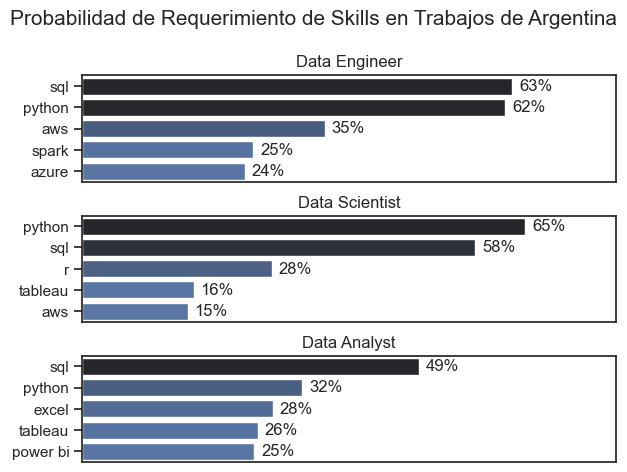

# Resumen

Bienvenidos a mi análisis del mercado laboral en el mundo de los datos. Este dataset contiene cuantiosa información al respecto, con mi enfoque puesto en investigar las skills mejores pagas y/o más buscadas en los empleos, para poder encontrar las oportunidades de trabajo más óptimas en este caso para un analista de datos, que es el trabajo de interés de este proyecto.

Las columnas contienen detallada información sobre cada rol, salario, ubicaciones y skills esenciales. El dataset tiene como fuente al repositorio de [Luke Barousse](https://huggingface.co/datasets/lukebarousse/data_jobs) en [Hugging Face](https://huggingface.co), una plataforma que uso asiduamente para obtener información en la cual poder realizar análisis de datos.

Para lograr los objetivos del proyecto, realizaré el análisis a través de unos scripts de Python. La obtención y visualización de la información de interés será usando este lenguaje y sus librerías.

# Incógnitas a resolver
1. ¿Ubicaciones de las búsquedas laborales de Analistas de Datos en Argentina?
2. ¿Qué compañías lideran las búsquedas de Analistas de Datos en Argentina?
3. ¿Cuántas de las búsquedas laborales en Argentina permiten el trabajo remoto? ¿Cuántas búsquedas laborales en Argentina mencionan el requerimiento de un título universitario?
4. ¿Cuáles son las skills más requeridas en el mundo de los datos?
5. ¿Cuál es la distribución salarial en los trabajos remotos?
6. ¿Qué skills son las más requeridas y/o mejores pagas en los trabajos remotos?


# Preparación y limpieza

En esta sección describo los pasos esenciales para preparar los datos para el análisis, para lograr precisión y utilidad de los mismos.

## Importación y limpieza de datos

El primer paso es importar cada una de las librerías necesarias (con su respectivo alias) y cargar el dataset, junto a algunos pasos de limpieza para asegurar la calidad de los datos.

```python
# Importamos librerías
import ast
import pandas as pd
import seaborn as sns
from datasets import load_dataset
import matplotlib.pyplot as plt

# Cargamos los datos
dataset = load_dataset('lukebarousse/data_jobs')
df = dataset['train'].to_pandas()

# Limpiamos los datos
df['job_posted_date'] = pd.to_datetime(df['job_posted_date']) # Usamos una función de Pandas para transformar la columna de 'str' a 'datetime'
df['job_skills'] = df['job_skills'].apply(lambda x: ast.literal_eval(x) if pd.notna(x) else x) # Usamos un módulo de Python para transformar la columna de 'str' a 'list'
```

# Análisis

Cada cuaderno Jupyter de este proyecto está dirigido a investigar aspectos específicos del mercado laboral de los datos.

Como aspirante a analista de datos, focalicé sobre dos mercados laborales que me podrían ser de interés:

1. Trabajos en Argentina
2. Trabajos de manera remota global

# Trabajos en Argentina

Creamos un DataFrame que contenga sólo los trabajos ubicados en Argentina.

```python
df_ARG = df[(df['job_country'] == 'Argentina')]
```

## 1. ¿Ubicaciones de las búsquedas laborales de Analistas de Datos?

Para encontrar las ubicaciones más comunes en búsqueda de un analista de datos, agrupamos y ordenamos el df según la ubicación. Antes de proceder a visualizar, realizamos unas tareas de limpieza del mismo en las entradas que tienen a "Argentina" como ciudad, lo cual indica que la búsqueda no especificó la ubicación concreta del empleo.

Como resultado de esta consulta obtenemos las top 10 ubicaciones con avisos de empleo, que posteriormente visualizamos utilizando las librerías Matplotlib y Seaborn.

Los pasos detallados de esta consulta se pueden observar en este cuaderno: [1_Análisis_de_Trabajos_en_Argentina](1_Análisis_de_Trabajos_en_Argentina.ipynb)

### Visualización de datos

```python
sns.set_theme(style='ticks')
sns.barplot(data=df_plot, x='count', y='job_location', hue='count', palette='dark:b_r', legend=False)
sns.despine()
plt.title('Empleos por Ubicación para Analista de Datos en Argentina')
plt.xlabel('Cantidad de empleos')
plt.ylabel('')
plt.show()
```

### Resultados


*Gráfico de barras visualizando las top 10 ubicaciones de búsqueda de Analistas de Datos en Argentina.*

### Observaciones:

- Buenos Aires acapara casi la totalidad del mercado laboral en territorio argentino, siendo 21 veces más grande que la provincia de Córdoba, la segunda ubicación geográfica del gráfico.
- El trabajo remoto parece una buena alternativa para los residentes del Interior del país, que de otra manera tienen un panorama desalentador con un número de búsquedas considerablemente minúsculo en comparación al área metropolitana.

## 2. ¿Qué compañías lideran las búsquedas de Analistas de Datos?

Con el objetivo de encontrar las compañías con más búsquedas publicadas de Analista de Datos, agrupamos el df según el nombre de la empresa. Aquí también debimos realizar tareas de limpieza para corregir valores incoherentes que no sean empresas, como plataformas de reclutamiento, entre otros.

El resultado fue las 8 empresas con más búsquedas, demostrando quiénes suelen ser las compañías en búsqueda constante de empleados.

Los pasos detallados de esta consulta se pueden observar en este cuaderno: [1_Análisis_de_Trabajos_en_Argentina](1_Análisis_de_Trabajos_en_Argentina.ipynb)

### Visualización de datos

```python
sns.set_theme(style='ticks')
sns.barplot(data=df_plot, x='count', y='company_name', hue='count', palette='dark:b_r', legend=False)
sns.despine()
plt.gca().xaxis.set_major_locator(plt.MaxNLocator(integer=True))
plt.title('Número de Trabajos por Compañía')
plt.xlabel('Número de Trabajos')
plt.ylabel('')
plt.show()
```

### Resultados


*Gráfico de barras visualizando las top 8 empresas liderando la búsqueda de Analistas de Datos en Argentina.*

### Observaciones:

- Empresas multinacionales de consultoría lideran las búsquedas, como Accenture o PwC. Estas se caracterizan por ofrecer diversos servicios en múltiples áreas por lo que es lógico que requieran más personal en el mundo de los datos.
- Se destaca la importancia de un analista de datos en el rubro financiero, con búsquedas numerosas desde instituciones bancarias como BBVA hasta compañías de inversión como S&P o JPMorgan.
- El único valor no perteneciente a uno de los otros grupos es IQVIA, una empresa perteneciente al rubro de la salud. Sin embargo, tiene sentido la necesidad de analista de datos, por ejemplo para optimizar la eficiencia operativa identificando tendencias e ineficiencias en los procesos sanitarios.

## 3. Trabajo Remoto & Mención de Título Universitario

Con la información disponible, también es de mi interés saber qué empresas permiten el trabajo remoto y cuántas exigen un título universitario como indispensable.

Ambas columnas contienen los valores 'Verdadero' y 'Falso', es por eso que utilizamos Seaborn y Matplotlib personalizando la visualización para que refleje las etiquetas correspondiente en cada caso. En este caso, utilizamos una gráfica circular para cada uno.

Los pasos detallados de esta consulta se pueden observar en este cuaderno: [1_Análisis_de_Trabajos_en_Argentina](1_Análisis_de_Trabajos_en_Argentina.ipynb)

### Visualización de datos

```python
fig, ax = plt.subplots(1, 2)
fig.set_size_inches((12, 5))

# Cuenta la cantidad de trabajos remotos
counts = df_job_ARG['job_work_from_home'].value_counts()

plt.subplot(1, 2, 1)
plt.pie(counts, labels=counts.index.map({False: 'No', True: 'Sí'}), autopct='%1.1f%%', startangle=90)
plt.title('Trabajo Remoto')

# Cuenta la cantidad de trabajos sin mención de título universitario
counts = df_job_ARG['job_no_degree_mention'].value_counts()

plt.subplot(1, 2, 2)
plt.pie(counts, labels=counts.index.map({False: 'Título requerido', True: 'Título no necesario'}), autopct='%1.1f%%', startangle=90)
plt.title('Requerimiento de Título Universitario')
plt.tight_layout()
plt.show()
```

### Resultados


### Observaciones:

- Sólo el 6,9% de las ofertas laborales ofrecen opciones de trabajo a distancia, mientras que la gran mayoría (93,1%) son funciones presenciales o híbridas.
- El 45,3% de los puestos exigen un título universitario, pero el 54,7% de los empleos no mencionan la necesidad de un título, lo que potencialmente ofrece más flexibilidad en los requisitos educativos.

## 4. ¿Cuáles son las skills más requeridas en el mundo de los datos?

Para encontrar las skills más demandadas en el mundo de los datos, obtuve las 5 habilidades principales previamente habiendo filtrado los avisos por los 3 roles más populares.

Los pasos detallados de esta consulta se pueden observar en este cuaderno: [2_Demanda_de_Skills_en_Argentina](2_Demanda_de_Skills_en_Argentina.ipynb)

### Visualización de datos

```python
fig, ax = plt.subplots(len(job_titles), 1)

sns.set_theme(style='ticks')

for i, job_title in enumerate(job_titles):
    df_plot = df_skills_perc[df_skills_perc['job_title_short'] == job_title].head(5)[::-1]
    sns.barplot(data=df_plot, x='skill_percent', y='job_skills', ax=ax[i], hue='skill_count', palette='dark:b_r')
    ax[i].set_title(job_title)
    ax[i].invert_yaxis()
    ax[i].set_ylabel('')
    ax[i].set_xlabel('')
    ax[i].get_legend().remove()
    ax[i].set_xlim(0, 78)
    ax[i].set_xticks([])

    for n, v in enumerate(df_plot['skill_percent']):
        ax[i].text(v + 1, n, f'{v:.0f}%', va='center')

fig.suptitle('Probabilidad de Requerimiento de Skills en Trabajos de Argentina', fontsize=15)
fig.tight_layout(h_pad=0.8)
plt.show()
```

### Resultados



*Gráfico de barras visualizando las top 5 skills en las búsquedas de los tres principales roles en el mundo de los datos en Argentina.*

### Observaciones:
- SQL es la habilidad más requerida tanto para Analistas de Datos como para Ingeniero de Datos, alcanzando casi la mitad de los avisos en ambos roles.
- Python es una habilidad cada vez más deseada, principalmente para Ingeniero de Datos y Científico de Datos, con más del 60% en estos casos.
